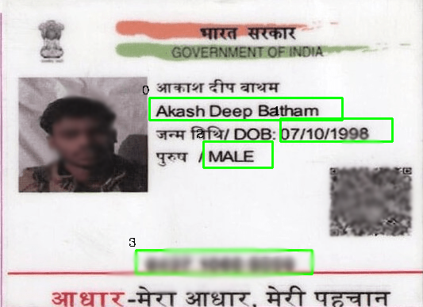
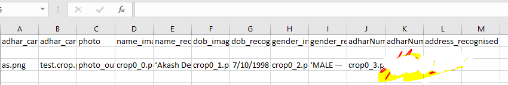

# Adhar-card-reader
This is the OCR which  extract all necessary information form adhar card and pancard. can be used by bank it will save lot of time.

Just run the node server on your computer and then signup with id and then login 
then you can add and remove adhar cards information from the web application automatically just by uploading a file
when you upload a file that info will be stored in csv/input.csv 
and for the address part you can provide a image and upload it. 
and the the python code will excecute and the and your all adhar information will be stored in web application.
 
 
 Adhar card Processed OUTPUT image  
 
 
 OUTPUT STORED IN CSV 

